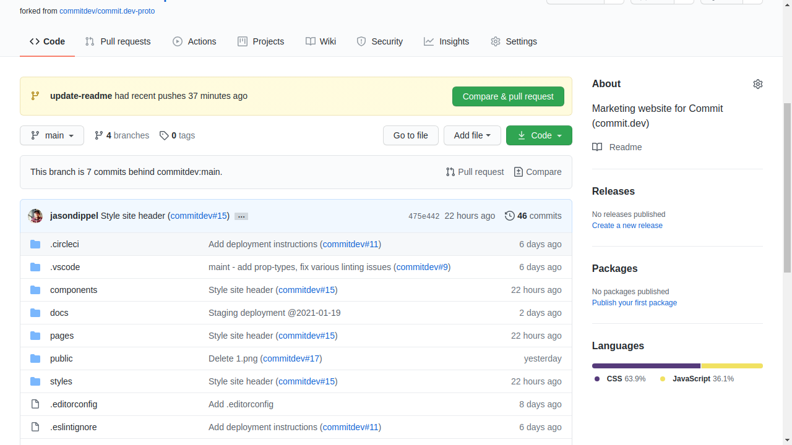
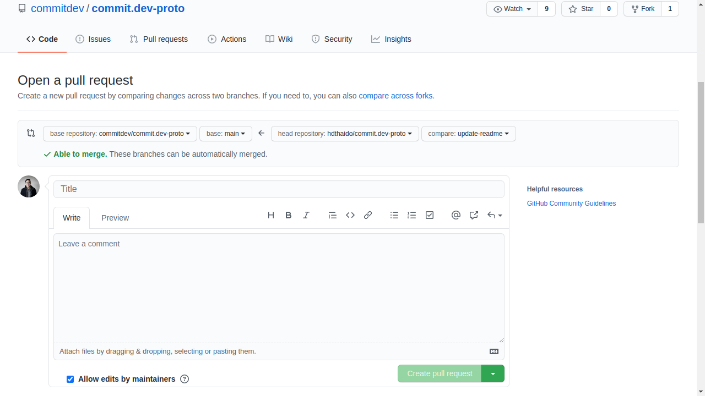

# Introduction
Marketing website for Commit (commit.dev).

You can find our staging website [here](https://landing.commit-staging.dev/).
# How to Contribute


## Fork this repository


For this repository by clicking on the fork button on the top of this page. This will create a copy of this repository in your account.

## Clone the repository


Now clone the forked repository to your machine. Go to your Github account, open the forked repository, click on the code button and then click then click the _copy to clipboard_ icon.

Open a terminal and run the following git command:

```
git clone "url you just copied
```

where "url you just copied" (without the quotation marks) is the url to this repository (your fork of this project). See the previous steps to obtain the url.


For example:

HTTPS Clone
```
git clone https://github.com/this-is-you/commit.dev-proto.git
```

OR

SSH Clone
```
git clone git@github.com:this-is-you/commit.dev-proto.git
```

where `this-is-you` is your Github username. Here you're copying the contents of the commit.dev-proto repository on Github to your computer.

## Create a branch

Change to the repository directory on your computer (if you are not already there):

```
cd commit.dev-proto
```

Now create a branch using the `git checkout` command:

```
git checkout -b your-new-branch-name
```

## Make necessary changes and commit those changes

Now open the file in a text editor and add your changes to  it.

If you go the project directory and execute the command `git status`, you'll see there are changes.

Add those changes to the branch you just created using the `git add` command:

```
git add <file-name>
```

OR

```
git add -A
```

Now commit those changes using the `git commit` command:

```
git commit -m "My message"
```

replacing `My message` with a commit message, such as `update README.md`

## Push changes to Github

Push your changes using the `git push` command:

```
git push origin <add-your-branch-name>
```

replacing `<add-your-branch-name>` with the name of the branch you created earlier.

## Submit your changes for review

If you go to your repository on Github, you'll see a `Compare & pull request` button. Click on that button.



Now submit the pull request



Soon one of our moderators will check all your changes and decide whether they will be commited into the main branch. You will get a notification email once the changes have been merged.

